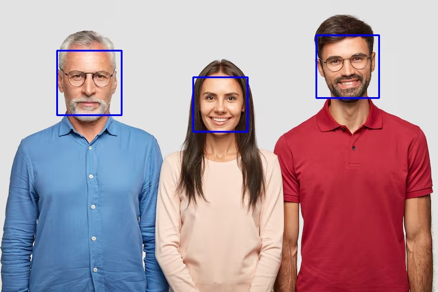

# Face Detection Web App

## Overview

This is a full-stack Face Detection Web Application built using React for the frontend and Flask for the backend. It uses OpenCV’s Haar Cascade classifier to detect faces in uploaded images and returns a processed image with bounding boxes drawn around detected faces.

The project demonstrates integration of computer vision with web development, covering image processing, REST API design, and frontend-backend communication.

---

## Tech Stack

### Frontend
- React, JavaScript, HTML, CSS

### Backend
- Flask, OpenCV, Numpy, Flask-CORS

---

## How It Works

1. User uploads an image from the React frontend.
2. The image is sent to the Flask backend using a POST request.
3. The backend processes the image using OpenCV:
   - Converts image to grayscale
   - Detects faces using Haar Cascade classifier
   - Draws rectangles around detected faces
4. The processed image is encoded into Base64 format.
5. The backend returns a JSON response containing:
   - Number of faces detected
   - Processed image (Base64 string)
6. The frontend receives the response and displays the processed image.

---

## Getting Started

### Backend
1. Clone the repo:
```bash
git clone https://github.com/yashdeep7733/RealTime-Face-Detection-System-1.1.0.git
cd RealTime-Face-Detection-System-1.1.0/backend
```
2.	Create a virtual environment and activate it:
```bash
python -m venv venv
source venv/bin/activate      # macOS/Linux
# venv\Scripts\activate       # Windows
```
3.	Install dependencies:
```bash
pip install -r requirements.txt
```
4.	Run the backend server:
```bash
python app.py
```
### Frontend
1.	Navigate to frontend folder:
```bash
cd ../frontend
```
2.	Install dependencies and run:
```bash
npm install
npm run dev
```
3.	Open in browser (usually at http://localhost:9000) and upload an image.

---

## Future Improvements

- Add webcam-based real-time face detection using OpenCV and browser camera stream
- Improve detection accuracy by replacing Haar Cascade with deep learning models (YOLO/DNN)
- Add face recognition feature to identify known individuals
- Deploy the application using cloud services like Render (backend) and Vercel (frontend)

Example detection below

<p align="center">
  
  
</p>
